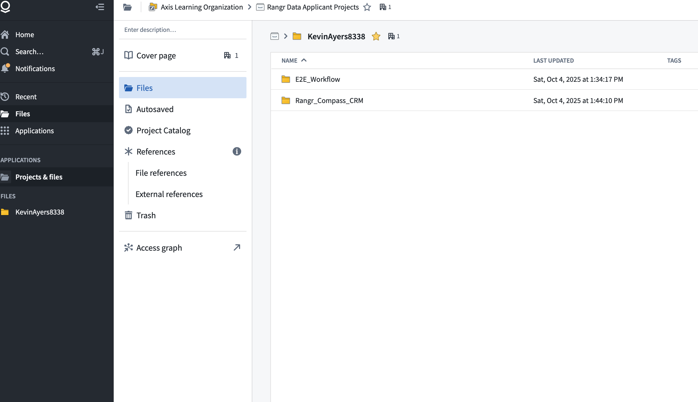

# Rangr_Compass_CRM - Project Documentation Journal

**Project:** Customer Relationship Management (CRM) Application
**Platform:** Palantir Foundry
**Timeline:** October 3-16, 2025
**Author:** Kevin

---

## 📋 Quick Reference

**Project Name:** Rangr_Compass_CRM
**User Persona:** Alex, a sales representative who needs to manage customer contacts and interactions
**GitHub Repo:** 
**Demo Video:** [To Do]

---

## 🎯 Project Goals & Success Criteria

### Primary Objectives
- [ ] Build functional data pipeline with company and person datasets
- [ ] Create ontology with Company and Person objects
- [ ] Develop Workshop UI with list and detail views
- [ ] Implement at least one working Action (Add Person)
- [ ] Demonstrate live editing capability
- [ ] Create comprehensive documentation

### Key Metrics
- Working end-to-end data flow
- Professional 5-minute demo
- Ability to make live edits in 3-5 minutes
- Clear business value narrative

---

## 📅 Daily Progress Log

### Friday, October 3, 2025
**Time Spent:** ___ hours
**Phase:** Foundation & Learning

#### Tasks Completed
- [ ] Completed Speedrun course
- [ ] Created user persona
- [ ] Reviewed datasets
- [ ] Set up project folder in Foundry

#### Key Learnings
```
[Add notes about what you learned from the Speedrun course]
-
-
-
```

#### Screenshots
- [x] Screenshot: Workspace
- [ ] Screenshot: Project folder structure



#### Challenges & Solutions
```
Challenge:
Solution:

Challenge:
Solution:
```

#### Tomorrow's Focus
```
[Pipeline]
```

---

### Saturday, October 4, 2025
**Time Spent:** ___ hours
**Phase:** Data Pipeline - Day 1

#### Tasks Completed
- [x] Ingested company dataset
- [x] Ingested person dataset
- [ ] Started Pipeline Builder transforms
- [ ] Cleaned company data
- [ ] Cleaned person data
- [ ] Watched Ontology tutorials

#### Pipeline Decisions
```
Dataset: Company
- Original columns:
- Cleaned columns:
- Data quality issues found:
  - nagative revunue found in the revunue column
  - missing companies found
  - duplicate company names found
  - no company id column found
- Transformations applied:

Dataset: Person
- Original columns:
- Cleaned columns:
- Data quality issues found:
- Transformations applied:
```

#### Screenshots
- [ ] Screenshot: Raw company data
- [ ] Screenshot: Raw person data
- [ ] Screenshot: Pipeline Builder - company transform
- [ ] Screenshot: Pipeline Builder - person transform
- [ ] Screenshot: Data quality check results

#### Key Code/Transforms
```python
# Add any important transform code snippets here
# Example: Column renaming logic


```

#### Challenges & Solutions
```
Challenge:
Solution:

Challenge:
Solution:
```

#### Notes for Demo
```
[Things to mention during demo about pipeline decisions]
-
-
```

---

### Sunday, October 5, 2025
**Time Spent:** ___ hours
**Phase:** Data Pipeline - Day 2 & Ontology

#### Tasks Completed
- [ ] Completed data joins in Pipeline Builder
- [ ] Created Company Object in Ontology
- [ ] Created Person Object in Ontology
- [ ] Created Company ↔ Person link
- [ ] Tested ontology queries
- [ ] Verified relationships work

#### Ontology Design Decisions
```
Company Object
- Primary Key:
- Key Properties:
  1.
  2.
  3.
- Why these properties:

Person Object
- Primary Key:
- Key Properties:
  1.
  2.
  3.
- Why these properties:

Link: Company → Person
- Link Type:
- Relationship:
- Why this structure:
```

#### Screenshots
- [ ] Screenshot: Pipeline Builder - final join
- [ ] Screenshot: Ontology Manager - Company object
- [ ] Screenshot: Ontology Manager - Person object
- [ ] Screenshot: Ontology Manager - Link configuration
- [ ] Screenshot: Test query showing relationships

#### Test Queries Run
```
Query 1: [Describe what you tested]
Result:

Query 2: [Describe what you tested]
Result:
```

#### Challenges & Solutions
```
Challenge:
Solution:

Challenge:
Solution:
```

#### Critical Checkpoint
- [ ] Can I query companies and see their related people? YES / NO
- [ ] If NO, what needs to be fixed:

#### Notes for Demo
```
[Ontology design rationale to explain]
-
-
```

---

### Monday, October 6, 2025
**Time Spent:** ___ hours
**Phase:** Workshop UI - Getting Started

#### Tasks Completed
- [ ] Created Workshop application
- [ ] Built company list view (table)
- [ ] Verified data loads correctly
- [ ] Debugged connection issues

#### UI Design Decisions
```
Company List View
- Components used:
- Columns displayed:
- Sorting/filtering:
- Why this layout:
```

#### Screenshots
- [ ] Screenshot: Workshop - blank canvas
- [ ] Screenshot: Workshop - company list table
- [ ] Screenshot: Workshop - data loading successfully

#### Challenges & Solutions
```
Challenge:
Solution:

Challenge:
Solution:
```

#### Notes for Demo
```
[UI design choices to explain]
-
-
```

---

### Tuesday, October 7, 2025
**Time Spent:** ___ hours
**Phase:** Workshop UI - Navigation

#### Tasks Completed
- [ ] Created company detail page
- [ ] Implemented navigation (list → detail)
- [ ] Displayed company information
- [ ] Showed related people for each company

#### UI Components Used
```
Company Detail Page
- Layout structure:
- Data display components:
- Related people section:
- Navigation pattern:
```

#### Screenshots
- [ ] Screenshot: Company list with clickable rows
- [ ] Screenshot: Company detail page - company info
- [ ] Screenshot: Company detail page - related people
- [ ] Screenshot: Navigation flow (before/after click)

#### Challenges & Solutions
```
Challenge:
Solution:

Challenge:
Solution:
```

#### Notes for Demo
```
[Navigation and UX choices to explain]
-
-
```

---

### Wednesday, October 8, 2025
**Time Spent:** ___ hours
**Phase:** Actions - Add Person

#### Tasks Completed
- [ ] Created "Add New Person" Action in Ontology
- [ ] Configured input fields
- [ ] Set up company linking
- [ ] Configured write-back to dataset
- [ ] Tested Action in Ontology Manager

#### Action Configuration
```
Action Name: Add New Person

Input Fields:
- Field 1: [name, type, required/optional]
- Field 2:
- Field 3:
- Field 4:

Validation Rules:
-
-

Write-back Configuration:
- Target dataset:
- Key mapping:
```

#### Screenshots
- [ ] Screenshot: Ontology Manager - Action configuration
- [ ] Screenshot: Action - input field setup
- [ ] Screenshot: Action - validation rules
- [ ] Screenshot: Test run of Action

#### Test Cases
```
Test 1: [What you tested]
Result:

Test 2: [What you tested]
Result:

Test 3: [Edge case tested]
Result:
```

#### Challenges & Solutions
```
Challenge:
Solution:

Challenge:
Solution:
```

---

### Thursday, October 9, 2025
**Time Spent:** ___ hours
**Phase:** Actions - UI Integration & Checkpoint

#### Tasks Completed
- [ ] Added "Add Person" button to Workshop
- [ ] Tested full workflow (UI → Action → Data)
- [ ] Debugged integration issues
- [ ] Ran checkpoint review

#### Integration Details
```
Button Placement:
Workflow Steps:
1.
2.
3.
4.

End-to-end test result:
```

#### Screenshots
- [ ] Screenshot: Workshop - "Add Person" button
- [ ] Screenshot: Action form in Workshop UI
- [ ] Screenshot: Before adding person
- [ ] Screenshot: After adding person (data visible)

#### 🚨 CRITICAL CHECKPOINT
```
✅ Can you view companies? YES / NO
✅ Can you see people linked to companies? YES / NO
✅ Can you add a new person? YES / NO
✅ Does data flow correctly through Pipeline → Ontology → Workshop? YES / NO

If any "NO" above, describe issue and fix plan:


Decision: PROCEED TO STRETCH GOALS / FOCUS ON CORE FIXES
```

#### Challenges & Solutions
```
Challenge:
Solution:

Challenge:
Solution:
```

---

### Friday, October 10, 2025
**Time Spent:** ___ hours
**Phase:** Stretch Goals OR Recovery

#### Path Taken: STRETCH GOALS / RECOVERY (circle one)

#### Tasks Completed
- [ ] [If stretch] Created "Log Interaction" Action
- [ ] [If stretch] Added interaction UI elements
- [ ] [If recovery] Fixed core functionality issues
- [ ] Stabilized application

#### [If Stretch] Interaction Logging Details
```
Action Name: Log Interaction

Input Fields:
-
-
-

Integration:
```

#### Screenshots
- [ ] Screenshot: [Relevant to path taken]
- [ ] Screenshot: [Relevant to path taken]

#### Notes
```
[Describe what you accomplished and why]


```

---

### Saturday, October 11, 2025
**Time Spent:** ___ hours
**Phase:** Polish & Demo Prep

#### Tasks Completed
- [ ] Polished Workshop UI
- [ ] Added page titles and descriptions
- [ ] Added KPI card (if time)
- [ ] Wrote demo script
- [ ] Recorded first demo video
- [ ] Took final screenshots

#### UI Polish Details
```
Improvements made:
-
-
-

KPI/Dashboard elements (if added):
-
```

#### Demo Script (Draft 1)
```
[00:00-00:30] Introduction
"I built ContactHub to help sales reps like Alex..."


[00:30-02:30] Architecture Overview
"The data flows through three layers..."


[02:30-04:30] Live Demo
"Let me show you how Alex would use this..."


[04:30-05:00] Value Proposition
"This enables Alex to..."


```

#### Screenshots for Documentation
- [ ] Screenshot: Final company list view
- [ ] Screenshot: Final company detail view
- [ ] Screenshot: Action form
- [ ] Screenshot: [Any KPI widgets]
- [ ] Screenshot: Pipeline Builder overview
- [ ] Screenshot: Ontology Manager overview

#### Demo Video Notes
```
Video 1 recording notes:
- What went well:
- What needs improvement:
- Timing:
- Re-record? YES / NO
```

---

### Sunday, October 12, 2025
**Time Spent:** ___ hours
**Phase:** Live Edit Practice & Final Demo

#### Live Edit Practice Log

##### Practice Session 1: Add New Property
```
Scenario: Add "Status" property to Person object

Time taken: ___ minutes
Steps completed:
1.
2.
3.

Challenges encountered:


Notes for improvement:


```

##### Practice Session 2: Add Filter to UI
```
Scenario: Add industry filter to company list

Time taken: ___ minutes
Steps completed:
1.
2.
3.

Challenges encountered:


Notes for improvement:


```

##### Practice Session 3: Modify Action
```
Scenario: Add validation to "Add Person" Action

Time taken: ___ minutes
Steps completed:
1.
2.
3.

Challenges encountered:


Notes for improvement:


```

##### Practice Session 4: Curveball Scenario
```
Scenario: [Something unexpected]

Time taken: ___ minutes
Approach taken:


Result:


Key learning:


```

#### Final Demo Video
```
Video 2 (Final) recording notes:
- Timing:
- Smoothness:
- Narrative clarity:
- Technical accuracy:
- Ready for submission? YES / NO
```

#### Screenshots
- [ ] Screenshot: Live edit - before
- [ ] Screenshot: Live edit - during
- [ ] Screenshot: Live edit - after

---

### Monday, October 13, 2025
**Time Spent:** ___ hours
**Phase:** Documentation & Q&A Prep

#### Tasks Completed
- [ ] Created GitHub repository
- [ ] Wrote README.md
- [ ] Uploaded screenshots
- [ ] Prepared interview answers
- [ ] Final demo run-through

#### Interview Q&A Preparation

##### Q: "Walk me through your data pipeline decisions"
```
Answer:


```

##### Q: "Why did you structure the ontology this way?"
```
Answer:


```

##### Q: "What would you add if you had more time?"
```
Answer:


```

##### Q: "How would you scale this for 10,000 companies?"
```
Answer:


```

##### Q: "What was the hardest part of building this?"
```
Answer:


```

##### Q: "How does this solve Alex's problem?"
```
Answer:


```

#### Documentation Checklist
- [ ] README.md complete
- [ ] All screenshots uploaded and embedded
- [ ] Demo video uploaded
- [ ] Architecture description clear
- [ ] Feature list accurate
- [ ] Links all working

---

### Tuesday, October 14, 2025
**Time Spent:** ___ hours
**Phase:** Final Practice

#### Demo Run-Through #___
```
Timing:
Smoothness (1-10):
Notes:


```

#### Foundry Terminology Self-Check
```
Can I confidently explain:
- [ ] Pipeline Builder and transforms
- [ ] Ontology objects and properties
- [ ] Links and relationships
- [ ] Actions and write-backs
- [ ] Workshop components and pages
```

#### Final Polish Items
- [ ] All documentation reviewed
- [ ] Demo script memorized
- [ ] Backup plan if tech issues
- [ ] Submission materials ready

---

### Wednesday, October 15, 2025
**Time Spent:** ___ hours
**Phase:** Final Review

#### Pre-Submission Checklist
- [ ] Application works end-to-end
- [ ] Demo video is clear and professional
- [ ] Documentation is complete
- [ ] Can explain every decision
- [ ] Confident in live edit scenarios
- [ ] Submission instructions reviewed
- [ ] All files backed up

#### Final Thoughts Before Submission
```
What I'm most proud of:


What I learned:


What I'd do differently:


Confidence level (1-10):
```

---

## 🎨 Screenshot Organization

### Pipeline Builder
1. `pipeline_01_raw_company_data.png` - Raw company dataset
2. `pipeline_02_raw_person_data.png` - Raw person dataset
3. `pipeline_03_company_transform.png` - Company cleaning transforms
4. `pipeline_04_person_transform.png` - Person cleaning transforms
5. `pipeline_05_final_join.png` - Joined dataset
6. `pipeline_06_overview.png` - Full pipeline view

### Ontology Manager
1. `ontology_01_company_object.png` - Company object configuration
2. `ontology_02_person_object.png` - Person object configuration
3. `ontology_03_link.png` - Company-Person link
4. `ontology_04_action_add_person.png` - Add Person Action
5. `ontology_05_action_log_interaction.png` - Log Interaction Action (if built)
6. `ontology_06_overview.png` - Full ontology view

### Workshop UI
1. `workshop_01_company_list.png` - Company list view
2. `workshop_02_company_detail.png` - Company detail view
3. `workshop_03_add_person_button.png` - Add Person button/form
4. `workshop_04_person_added.png` - After adding person
5. `workshop_05_kpi_widget.png` - KPI dashboard (if built)
6. `workshop_06_full_flow.png` - Complete user flow

### Live Edit Examples
1. `live_edit_01_before.png` - Before adding property
2. `live_edit_02_during.png` - Adding property in Ontology
3. `live_edit_03_after.png` - Property visible in UI

---

## 💡 Key Insights & Learnings

### Technical Learnings
```
About Pipeline Builder:
-
-
-

About Ontology:
-
-
-

About Workshop:
-
-
-

About Actions:
-
-
-
```

### Design Decisions That Worked
```
1.

2.

3.
```

### Things I'd Do Differently
```
1.

2.

3.
```

### Unexpected Challenges
```
Challenge 1:
How I solved it:

Challenge 2:
How I solved it:

Challenge 3:
How I solved it:
```

---

## 🎬 Demo Day Preparation

### Pre-Demo Checklist (Day Of)
- [ ] Foundry environment working
- [ ] All data loaded correctly
- [ ] Actions tested and working
- [ ] Demo script reviewed
- [ ] Backup screenshots ready
- [ ] Questions and answers reviewed
- [ ] Water bottle filled
- [ ] Deep breath taken 😊

### Demo Script (Final Version)
```
[Write your final, polished script here after practice]
```

### Anticipated Live Edit Requests
```
1. Most likely:

2. Moderately likely:

3. Curveball:
```

---

## 📊 Time Tracking Summary

| Phase | Planned Hours | Actual Hours | Variance |
|-------|---------------|--------------|----------|
| Foundation (Oct 3-6) | 8-12 | | |
| Core Build (Oct 7-10) | 4-8 | | |
| Polish & Practice (Oct 11-12) | 8-12 | | |
| Documentation (Oct 13-15) | 4-6 | | |
| **TOTAL** | **24-38** | | |

---

## 🎯 Post-Submission Reflection

### What Went Well
```


```

### What Was Challenging
```


```

### Key Takeaways for Future Projects
```


```

### Skills Demonstrated
- [ ] Data engineering (Pipeline Builder)
- [ ] Data modeling (Ontology)
- [ ] UI/UX development (Workshop)
- [ ] Problem-solving
- [ ] Business analysis (CRM requirements)
- [ ] Communication (Demo presentation)
- [ ] Adaptability (Live edits)

---

## 📎 Resources & References

### Foundry Documentation Used
```
-
-
-
```

### Helpful Tutorials
```
-
-
-
```

### External Resources
```
-
-
-
```

---

**Project Status:** 🟢 In Progress | 🟡 Needs Attention | 🔴 Blocked | ✅ Complete

**Last Updated:** [Date]
